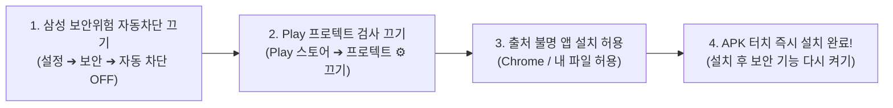

# Hi_Dorm SMS Relay Bridge (Android)
**24/7 Enterprise SMS Relay Daemon**

<p align="left">
  
  
  
  
  
  
  
</p>

> 기숙사 통합 관리 시스템(Hi_Dorm)과 공기계(알뜰폰 무제한 요금제 USIM)를 직결하여, 24시간 365일 무중단으로 문자(SMS/LMS)를 학생들에게 초저비용·고신뢰성으로 중계 발송하는 안드로이드 엔터프라이즈 브릿지 데몬 애플리케이션입니다.  
> **iOS 다크 아키텍처**와 **독립형 P2P 자동 포워딩(1번➔2번➔3번)** 기술을 완벽하게 탑재했습니다.

---

## 📥 최신 릴리즈 다운로드 (Download APK)

최신 공식 빌드 산출물은 GitHub Releases를 통해 직접 다운로드할 수 있습니다:

| 패키지 유형 | 파일명 | 파일 크기 | 다운로드 링크 | 용도 |
| :--- | :--- | :--- | :---: | :--- |
| **Release APK (권장)** | `app-release.apk` | 6.35 MB | [⬇️ 다운로드](https://github.com/lsk0522/Hi_Dorm_SMS/releases/download/v1.0.0/app-release.apk) | 상용 현장 거치 및 실운영 배포용 |
| **Debug APK** | `app-debug.apk` | 7.88 MB | [⬇️ 다운로드](https://github.com/lsk0522/Hi_Dorm_SMS/releases/download/v1.0.0/app-debug.apk) | 기능 개발, 로그 디버깅 및 시뮬레이션용 |

👉 **전체 릴리즈 노트 확인:** [GitHub Releases v1.0.0](https://github.com/lsk0522/Hi_Dorm_SMS/releases/tag/v1.0.0)

---

## 📱 단말기 설치 방법 (⚠️ 설치 불가 / 강제 차단 시 필독)

최신 안드로이드(13~15+) 및 삼성 갤럭시(One UI 6/7)에서는 외부 APK 설치 시 **두 가지 보안 엔진(삼성 Auto Blocker + 구글 Play 프로텍트)**이 작동하여 설치를 차단합니다. **"무시하고 설치" 버튼이 아예 안 뜨는 경우** 아래 순서대로 10초만 설정을 변경해 주시면 즉시 설치됩니다.



### 1단계: 삼성 갤럭시 「보안 위험 자동 차단」 끄기 (Galaxy 필수 ⭐⭐⭐)
삼성 One UI 6+ 단말기에 기본 탑재된 기능으로, 켜져 있으면 외부 APK 설치가 원천 차단됩니다:
1. 단말기 **[설정]** 앱 실행
2. **[보안 및 개인정보 보호]** 메뉴 진입
3. **[보안 위험 자동 차단 (Auto Blocker)]** 터치
4. 상단 스위치를 **`사용 안 함 (꺼짐)`**으로 임시 비활성화  
   *(※ 설치 완료 후 다시 켜셔도 이미 설치된 앱은 정상 작동합니다.)*

---

### 2단계: Google Play 프로텍트 검사 끄기 ("무시하고 설치" 버튼이 없을 때 ⭐⭐⭐)
구글이 2024년부터 SMS 권한이 있는 비인가 외부 앱에 대해 **"무시하고 설치" 버튼을 숨기고 강제 차단**하도록 정책을 강화했습니다. Play 스토어에서 검사를 **10초간 잠깐 끄고 설치**해야 합니다:

1. 스마트폰에서 **`Google Play 스토어`** 앱 실행
2. 우측 상단 **[내 프로필 아이콘]** 터치
3. **[Play 프로텍트]** 메뉴 진입
4. 우측 상단 **`⚙️ (설정 톱니바퀴)`** 터치
5. 맨 위 **`Play 프로텍트로 앱 검사`** 스위치를 **`끄기 (비활성화)`**  
   *(팝업창에서 [끄기] 확인)*
6. 이제 다운로드한 **`app-release.apk`를 누르면 차단 창 없이 즉시 1초 만에 설치됩니다!**
> 💡 *설치가 완료된 후에는 Play 스토어로 돌아가서 해당 스위치를 다시 켜셔도 이미 설치된 앱은 안전하게 유지됩니다.*

---

### 3단계: 「출처를 알 수 없는 앱 설치」 허용
1. **[설정] ➔ [보안 및 개인정보 보호] ➔ [출처를 알 수 없는 앱 설치]** 진입
2. APK를 다운로드한 앱(예: **Chrome**, **삼성 인터넷**, 또는 **내 파일**)의 토글을 **`허용`**으로 켭니다.

---

### 4단계: 기존 구버전 앱 충돌 방지 (서명 충돌 해결)
만약 이전에 설치했던 `Hi_Dorm` 테스트 앱이 폰에 이미 있다면 서명 불일치로 설치 실패가 발생합니다:
* 홈 화면에서 기존 `Hi_Dorm` 앱을 **길게 눌러 [설치 삭제(제거)]한 뒤** 새 APK를 설치해 주세요.

## 🧭 시스템 아키텍처 (System Architecture)

본 시스템은 **(A) 독립형 직결 P2P 자동 중계 모드**와 **(B) 기숙사 클라우드 서버 연동 모드**의 2대 운영 모드를 완벽 지원합니다.

```mermaid
flowchart TB
    subgraph ModeA["[모드 A] 독립형 직결 P2P 자동 포워딩 (서버 불필요)"]
        direction LR
        P1["1번 폰\n(트리거 발신자)"] -->|SMS 발송| P2["2번 공기계 (Hi_Dorm Bridge)\n· WakeLock 20s 획득\n· E.164 번호 정규화\n· EUC-KR 90B 분기"]
        P2 -->|자동 재발송 (0-User)| P3["3번 폰\n(최종 관리자 수신)"]
    end

    subgraph ModeB["[모드 B] 클라우드 중앙 관제 하이브리드 브릿지"]
        direction LR
        Server["Hi_Dorm 백엔드\n(Spring Boot / Node.js)"] <-->|WebSocket 푸시\n(Fallback HTTP 3s)| Daemon["2번 공기계 발송 데몬\n· 1.5~3초 가변 딜레이\n· 일일 450건 스팸 차단\n· Room DB 로컬 큐"]
        Daemon -->|단체 SMS/LMS 발송| Students["기숙사 전교생\n(사생 단말)"]
        Students -.->|답장 회신 감지| Daemon
        Daemon -.->|Inbound Webhook| Server
    end

    ModeA --- ModeB
```

---

## 🎨 UI & Design System Specification

`Hi_Dorm_SMS`는 iOS 다크 모드 및 Human Interface Guidelines(HIG)의 시각적 원칙을 준수하여 설계되었습니다.

```
┌──────────────────────────────────────────────────────────┐
│  Hi_Dorm Relay                      [History] [Settings] │
│  24/7 Enterprise Relay Daemon                            │
├──────────────────────────────────────────────────────────┤
│  ╭────────────────────────────────────────────────────╮  │
│  │ SMS Relay Daemon                  [   Toggle   ]   │  │
│  │ 🟢 DAEMON RUNNING (Live Pill)                      │  │
│  │ [ ⚡ 충전 중 100% ]          [ Cloud Online (WS) ] │  │
│  ╰────────────────────────────────────────────────────╯  │
│  ╭────────────────────────────────────────────────────╮  │
│  │ Today's Transmission                     0 / 450건 │  │
│  │ [==================== Progress Bar =============]  │  │
│  │  ╭─────────────╮  ╭─────────────╮  ╭─────────────╮ │  │
│  │  │   SUCCESS   │  │   FAILED    │  │    QUEUE    │ │  │
│  │  │      0      │  │      0      │  │      0      │ │  │
│  │  ╰─────────────╯  ╰─────────────╯  ╰─────────────╯ │  │
│  ╰────────────────────────────────────────────────────╯  │
│  ╭────────────────────────────────────────────────────╮  │
│  │ Action & Simulation Center                         │  │
│  │ [ Inset Input Phone Number                       ] │  │
│  │ [ Inset Input Message                            ] │  │
│  │ [ Primary Blue Button: 단건 테스트 발송 ]        │  │
│  │ [ Accent Orange Button: 🧪 7대 엣지 시뮬레이션 ]  │  │
│  ╰────────────────────────────────────────────────────╯  │
│  LIVE CONSOLE OUTPUT                                     │
│  ╭────────────────────────────────────────────────────╮  │
│  │ [System] Ready for relay daemon (Monospace Green)  │  │
│  ╰────────────────────────────────────────────────────╯  │
└──────────────────────────────────────────────────────────┘
```

### 1. 시맨틱 컬러 팔레트 (Semantic Color Palette)
* **Canvas Background:** `#000000` (OLED True Black, 0-nit 완전 소등으로 배터리 절감 및 번인 방지)
* **Primary Card Surface:** `#1C1C1E` (Secondary System Background, 다크 1차 서피스)
* **Secondary Inset Surface:** `#2C2C2E` (Tertiary System Background, 내부 컴포넌트 & 인셋 인풋)
* **1px Glass Rim Highlight:** `#2C2C2E` / `#3A3A3C` (미세 외곽선 스트로크)
* **System Tints:**
  - `system-blue`: `#0A84FF` (메인 액션 버튼 & 활성 링크)
  - `system-green`: `#30D158` (데몬 정상 구동 뱃지 & 성공 카운트)
  - `system-orange`: `#FF9F0A` (시뮬레이터 & 통신 지연 경고)
  - `system-red`: `#FF453A` (야간 모드 & 데몬 정지/실패)

### 2. G2 곡률 연속성 & 동심 곡률 공식
부드러운 스퀴클(Squircle) 곡률과 동심원 규칙을 XML Drawable로 구현했습니다:
* **외곽 카드 곡률:** `22dp` (`apple_card_bg.xml`)
* **내부 인셋 컴포넌트 곡률:** $\mathbf{R_{child} = R_{parent} - Padding} = 22\text{dp} - 8\text{dp} = \mathbf{14dp}$ (`apple_card_inner.xml`, `apple_input_bg.xml`)
* **상태 뱃지:** 완전한 알약 캡슐(`pill shape`, radius `50dp`)

---

## ⚡ 핵심 기술 컴포넌트 & 엣지케이스 방어망

| 핵심 엔지니어링 항목 | 직면 문제점 및 기술적 도전 | `Hi_Dorm_SMS`의 해결 아키텍처 |
| :--- | :--- | :--- |
| **1. 안드로이드 Doze Mode 돌파** | 화면이 꺼지면 OS가 CPU를 딥 슬립 상태로 전환하여 수신 리시버 미작동 | `PARTIAL_WAKE_LOCK`(20초) 획득 + `goAsync()` 비동기 스레드 전환으로 즉시 처리 |
| **2. 통신사 국가번호 불일치** | 기지국에 따라 `+82 10`, `010`, `8210` 등 번호 포맷이 달라 필터링 실패 | `PhoneNumberNormalizer.kt`를 통한 **E.164 국제 표준 정규화** (`+82 10` ➔ `010` 보정) |
| **3. SMS/LMS 바이트 경계** | 한글(2바이트) 특성 미고려 시 글자 깨짐 및 비정상 요금 과금 | `SmsMessageFormatter.kt`의 **EUC-KR 90바이트 자동 계산** 및 LMS 멀티파트 분기 |
| **4. 통신사 스팸 번호 정지** | 단시간 대량 발송 시 통신사 AI 기지국 필터에 의해 번호 직권 정지 | **건당 1.5초~3초 가변 딜레이** + **일일 450건 도달 시 자동 일시정지** (KISA 500건 규정 방어) |
| **5. 단말기 발열 및 스웰링** | 24시간 충전기 상시 거치 시 배터리 과열(45°C+) 및 부풀림 현상 | **45°C 이상 감지 시 스마트 쿨다운(30초 대기)** + 배터리 수명 보호(80% 제한) 연동 |
| **6. 프로세스 강제 종료** | 메모리 부족(OOM) 시 백그라운드 서비스 피살 | **포그라운드 서비스(Ongoing Notification)** + **15분 주기 워치독 알람(AlarmManager)** 자동 부활 |
| **7. 재부팅 무인 기동** | 야간 OS 자동 업데이트 후 기기 재부팅 시 잠금 해제 전까지 앱 정지 | **Direct Boot (FBE)** 적용으로 잠금 화면을 풀지 않아도 `BootReceiver`가 즉각 가동 |

---

## 🧪 내장 7대 엣지케이스 자동 시뮬레이션

앱 내 메인 대시보드의 **`🧪 7대 엣지케이스 자동 시뮬레이션`** 버튼을 탭하면, 물리적 통신사 회선 없이도 가상 모의 테스트가 콘솔에 실시간 수행됩니다:

```text
[시뮬레이션] === 7대 통신사 엣지케이스 테스트 시작 ===
[Case 1 통과] 국가번호 변환 성공 (+82 10 1234 5678 -> 01012345678)
[Case 2 통과] 특수문자/하이픈 정규화 성공 (010-9876-5432 -> 01098765432)
[Case 3 통과] 단문 SMS EUC-KR 80바이트 정상 판정 (LMS 미분기)
[Case 4 통과] 장문 LMS EUC-KR 150바이트 초과 감지 및 멀티파트 분기 성공
[Case 5 통과] 등록된 1번 폰 트리거 필터링 통과
[Case 6 통과] 미등록 번호(010-0000-0000) 포워딩 차단 성공
[Case 7 통과] 일일 발송 상한(450건) 도달 시 스팸 락 안전 차단 성공
[시뮬레이션] === 모든 케이스 통과! (ALL PASSED) ===
```

---

## 📱 2번 중계 단말기 7단계 세팅 체크리스트

단말기를 현장(관리실/서버실)에 상시 거치할 때 수행해야 하는 필수 설정입니다:

1. **배터리 최적화 완전 무제한:**
   `설정 > 애플리케이션 > Hi_Dorm SMS Relay > 배터리 > 제한 없음(Unrestricted)`
2. **백그라운드 사용 제한 해제:**
   `설정 > 배터리 > 백그라운드 앱 사용 제한 > 절전 예외 앱 추가`
3. **충전 중 화면 켜짐 유지 (Stay Awake):**
   `설정 > 개발자 옵션 > 충전 중 화면 켜짐 유지` 활성화
4. **배터리 보호(스웰링 방지) 모드:**
   `설정 > 배터리 > 배터리 보호 (최대 80~85% 충전 제한)`
5. **팬텀 프로세스 킬러(Phantom Process Killer) 무력화 (안드로이드 12~14+):**
   ```bash
   adb shell device_config put activity_manager max_phantom_processes 2147483647
   ```
6. **알림 및 문자 접근 권한 일괄 허용:**
   앱 최초 실행 시 요청되는 SMS 발송/수신, 전화 상태, 알림 권한을 모두 "항상 허용"합니다.
7. **Wi-Fi 절전 모드 해제:**
   `설정 > Wi-Fi > 고급 > 절전 모드 해제 및 항상 연결 유지`

---

## 📂 프로젝트 아키텍처 및 디렉토리 구조

```text
Hi_Dorm_SMS/
├── .github/workflows/
│   └── build-apk.yml               # GitHub Actions CI/CD (테스트, APK 빌드 & Release)
├── docs/
│   ├── DEVICE_SETUP_GUIDE.md       # 안드로이드 12~14+ 무제한 상주 7단계 설정 가이드
│   ├── SMS_AUTO_FORWARDING_GUIDE.md# 1번➔2번➔3번 자동 포워딩 시스템 설계 및 가이드
│   ├── SIMULATION_AND_EDGE_CASE_REPORT.md # 7대 통신사 엣지케이스 분석 및 시뮬레이션 리포트
│   └── SMS_Relay_Implementation_Guide.md # Word 기획서 원문 이관 가이드
├── app/
│   ├── build.gradle.kts            # 모듈 빌드 스크립트 (SDK 34, Room, Retrofit, Coroutines)
│   └── src/
│       ├── main/
│       │   ├── AndroidManifest.xml # 권한, Direct Boot, Foreground Service 선언
│       │   ├── java/com/hidorm/smsrelay/
│       │   │   ├── HiDormRelayApp.kt   # Application (알림 채널, 싱글톤 인스턴스)
│       │   │   ├── data/
│       │   │   │   ├── local/          # Room DB (MessageEntity, MessageDao, AppDatabase)
│       │   │   │   ├── remote/         # Retrofit API, WebSocketManager, DTO
│       │   │   │   └── repository/     # RelayRepository (로컬 큐, 네트워크, 설정 동기화)
│       │   │   ├── modem/
│       │   │   │   └── SmsSender.kt    # SmsManager 연동, Multipart 분할 및 ResultCode 추적
│       │   │   ├── service/
│       │   │   │   ├── SmsRelayForegroundService.kt  # 24/7 포그라운드 상주 발송 엔진
│       │   │   │   ├── BootReceiver.kt               # 기기 부팅 시 자동 시작 리시버
│       │   │   │   ├── SmsReceiver.kt                # SMS 수신 감지 및 1➔3 직결 포워딩 리시버
│       │   │   │   └── WatchdogReceiver.kt           # 프로세스 생존 감시 워치독
│       │   │   ├── simulator/
│       │   │   │   └── SmsSimulationEngine.kt        # 7대 엣지케이스 자동 모의 시뮬레이터
│       │   │   ├── util/
│       │   │   │   ├── PhoneNumberNormalizer.kt      # 한국 전화번호 정규화 및 E.164 파싱
│       │   │   │   └── SmsMessageFormatter.kt        # EUC-KR 90바이트 계산 및 LMS 포맷터
│       │   │   └── ui/
│       │   │       ├── MainActivity.kt               # 메인 대시보드 (Dark Architecture)
│       │   │       ├── MainViewModel.kt              # 대시보드 뷰모델
│       │   │       ├── SettingsActivity.kt           # iOS Inset Grouped 설정 화면
│       │   │       ├── HistoryActivity.kt            # 전송 및 릴레이 내역 화면
│       │   │       └── HistoryAdapter.kt             # 상태 뱃지 내역 리스트 어댑터
│       │   └── res/
│       │       ├── drawable/                         # 22dp 스퀴클, 14dp 동심 카드, 알약 뱃지
│       │       ├── layout/                           # OLED True Black 3단 UI 레이아웃
│       │       └── values/                           # 다크 모드 시맨틱 컬러 및 테마
│       └── test/                                     # 단위 테스트 (정규화, 바이트 계산, 필터링)
├── SPECIFICATION.md                # 종합 개발 및 배포 기술 명세서
└── README.md                       # 시스템 개요 및 운영 가이드
```

---

## 🛠️ 개발 및 빌드 환경

* **언어:** Kotlin 1.9.22
* **최소 SDK (Min SDK):** Android 8.0 (API 26)
* **타겟 SDK (Target SDK):** Android 14.0 (API 34)
* **주요 라이브러리:**
  - AndroidX Core KTX 1.13.1
  - Material Components 1.12.0
  - Room SQLite Database 2.6.1
  - Retrofit 2.11.0 & OkHttp 4.12.0 (WebSocket)
  - Kotlinx Coroutines 1.8.0
* **CI/CD:** GitHub Actions (`.github/workflows/build-apk.yml`)

---

## 📄 라이선스 (License)

이 프로젝트는 [MIT License](LICENSE)에 따라 자유롭게 사용 및 배포할 수 있습니다.
