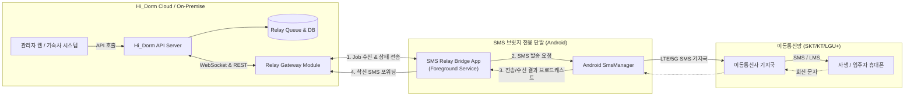
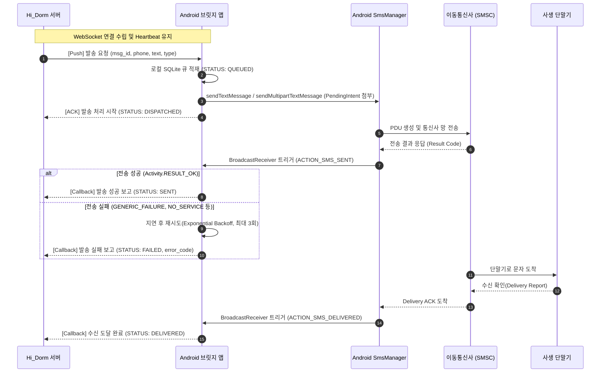
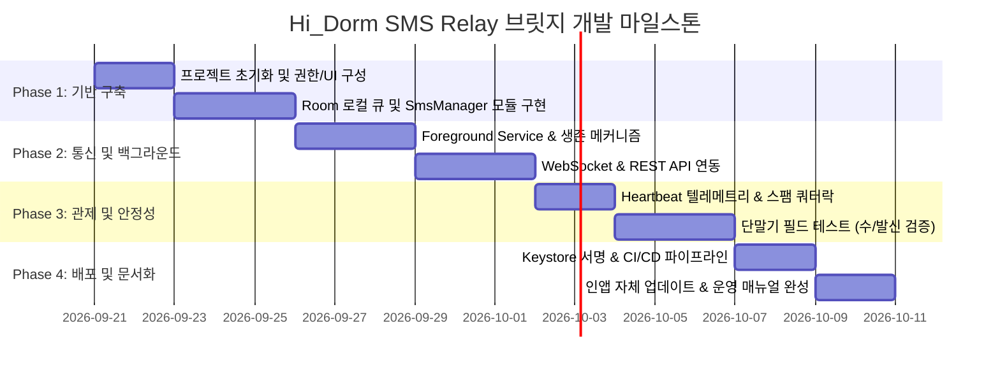

# Hi_Dorm SMS Relay 브릿지 시스템 개발 및 APK 배포 명세서

---

## 1. 개요 (Overview)

### 1.1 프로젝트 목적
**Hi_Dorm SMS Relay 브릿지**는 기숙사 통합 관리 시스템(Hi_Dorm Backend)과 연동하여, 고비용의 유료 상용 SMS 게이트웨이(건당 15~30원) 대신 **Android 전용 단말기(알뜰폰 무제한 요금제 공기계 등)를 브릿지(Relay Agent)로 활용하여 학생들에게 안내 문자를 저비용·고신뢰성으로 자동 발송 및 중계**하는 시스템입니다.

### 1.2 주요 기능 요약
1. **아웃바운드(Outbound) SMS 발송:** 백엔드 발송 큐(Queue)의 메시지를 수신하여 단말기 통신사 모뎀을 통해 수신자(학생/사생)에게 문자(SMS/LMS) 발송.
2. **인바운드(Inbound) SMS 중계:** 수신된 학생들의 답장/인증 문자를 백엔드 Webhook으로 실시간 포워딩.
3. **무중단 백그라운드 상주:** Foreground Service, Doze Mode(배터리 최적화) 예외, 부팅 자동 시작, Watchdog 생존 보장.
4. **발송 결과 추적 및 리포팅:** 통신사 기지국 전송 성공/실패 여부(`SENT`, `DELIVERED`, `FAILED`)를 백엔드로 실시간 콜백.
5. **통신사 스팸 정책 보호:** 전송 간격 딜레이(Throttling) 및 일일 쿼터 모니터링을 통한 단말기 발송 정지 방지.
6. **사내 전용 APK 배포 체계:** Google Play 정책 제한 회피를 위한 자체 APK 빌드, 서명, 인앱 업데이트(Self-Update) 체계 구축.

---

## 2. 시스템 아키텍처 (System Architecture)

### 2.1 전체 토폴로지



### 2.2 메시지 발송 흐름 시퀀스



---

## 3. 핵심 기능 상세 명세 (Functional Specifications)

### 3.1 F-01: 실시간 연동 및 메시지 큐 엔진
| 항목 | 상세 내용 |
| :--- | :--- |
| **기본 통신 방식** | **WebSocket (STOMP 또는 Raw WS)** 실시간 양방향 통신 |
| **대체(Fallback) 방식** | 네트워크 불안정 시 **HTTP Polling (주기: 3~5초)** 자동 전환 |
| **로컬 큐잉 (Room DB)** | 네트워크 단절 시에도 수신된 작업을 손실 없이 보관하기 위해 SQLite(Room)에 `MessageQueue` 엔티티 영속화 |
| **발송 간격 조절 (Throttling)** | 통신사의 단시간 대량 발송(스팸 차단) 필터링 회피를 위해 **건당 최소 1.5초~3초의 가변 딜레이** 적용 |
| **자동 분할 (SMS/LMS)** | 영문/숫자 160자, 한글 70~80자(90 bytes) 초과 시 `divideMessage()` 후 `sendMultipartTextMessage()`로 분할 전송 |

### 3.2 F-02: Android 단말 모뎀 제어 (`SmsManager`)
| 항목 | 상세 내용 |
| :--- | :--- |
| **발송 API** | `android.telephony.SmsManager` (Android 12+의 경우 `context.getSystemService(SmsManager.class)`) |
| **전송 결과 브로드캐스트** | `PendingIntent.getBroadcast()`를 이용한 `ACTION_SMS_SENT` 리시버 등록 및 리절트 코드 파싱 (`RESULT_OK`, `RESULT_ERROR_GENERIC_FAILURE`, `RESULT_ERROR_RADIO_OFF`, `RESULT_ERROR_NO_SERVICE` 등) |
| **수신 확인 브로드캐스트** | `ACTION_SMS_DELIVERED` 수신 리포트 지원 |
| **수신(Inbound) 리스너** | `android.provider.Telephony.SMS_RECEIVED` 리시버를 통한 착신 문자 파싱 -> 서버 Webhook (`POST /api/relay/inbound`) 즉각 전달 |
| **듀얼 SIM 지원** | 단말기에 SIM이 2개 장착된 경우 발송할 `SubscriptionId`를 설정에서 선택 가능하도록 구현 |

### 3.3 F-03: 무중단 백그라운드 생존 보장 (24/7 Resilience)
공기계 단말기는 1년 365일 중단 없이 상주해야 하므로 아래 안드로이드 백그라운드 제한 우회 처리를 반드시 구현합니다.

1. **Foreground Service 등록:**
   - `android.permission.FOREGROUND_SERVICE` 및 Android 14+ 대응 `FOREGROUND_SERVICE_TYPE_DATA_SYNC` 선언.
   - 상단 상태바(Notification Bar)에 발송 통계와 상태를 표시하는 고정 알림(Ongoing Notification) 게시.
2. **배터리 최적화(Doze Mode) 해제:**
   - `Settings.ACTION_REQUEST_IGNORE_BATTERY_OPTIMIZATIONS` 인텐트를 실행하여 화이트리스트 등록 강제 유도.
3. **부팅 자동 시작 (Auto-Start on Boot):**
   - `RECEIVE_BOOT_COMPLETED` 권한과 `BootCompletedReceiver`를 구현하여 단말기 재부팅 시 즉시 서비스 재시작.
4. **Watchdog 타이머 (AlarmManager / WorkManager):**
   - 15분 주기로 서비스 생존 여부를 검사하여 프로세스가 비정상 종료(OOM Killer 등)되었을 경우 자동 재기동.
5. **WakeLock 관리:**
   - 메시지 발송 처리 구간에만 `PARTIAL_WAKE_LOCK`을 일시 획득 후 즉시 해제(배터리 과열 및 팽창 방지).

### 3.4 F-04: 단말 상태 관제 및 텔레메트리 (Heartbeat)
- **주기:** 30초 ~ 60초 간격
- **수집 데이터:**
  - `battery_level` (잔여 배터리 %), `is_charging` (충전 여부)
  - `network_type` (WIFI / MOBILE LTE / NONE), `signal_strength` (RSSI)
  - `pending_queue_count` (미발송 큐 적재 건수)
  - `daily_sent_count` (금일 누적 발송 건수)
  - `sim_operator` (통신사 정보 - SKT/KT/LGU+ 등)
- **이상 징후 알림:**
  - 충전선 분리 또는 배터리 15% 이하 시 서버 알림
  - 연속 3회 Heartbeat 누락 시 관리자(Slack/Discord/알림톡) 비상 호출

### 3.5 F-05: 관리자 UI (Admin App Dashboard)
- **메인 화면:**
  - 서비스 On/Off 토글 버튼
  - 서버 연결 상태 인디케이터 (초록/빨강 LED)
  - 오늘 발송 현황 (성공: N건, 실패: N건, 대기: N건)
  - 통신사 일일 발송 한도 프로그레스 바 (예: 500건 중 120건)
- **설정 화면:**
  - 서버 URL (예: `https://api.hidorm.internal/relay`)
  - 디바이스 인증 토큰 (`Device Secret Key`)
  - 발송 딜레이 설정 (기본값: 2,000ms)
  - 1일 최대 발송 제한 쿼터 설정 (예: 450건 도달 시 자동 중지)
- **테스트 화면:**
  - 임의 수신 번호와 본문 입력 후 단건 즉각 발송 테스트

---

## 4. 통신사 정책 준수 및 스팸 방지 (Carrier Compliance)

> [!WARNING] 통신사 문자 무제한 요금제 정책 및 방통위 규제
> 국내 이동통신 3사 및 알뜰폰(MVNO)의 '문자 기본제공/무제한' 요금제는 **상업적 스팸 발송 방지 조항**이 적용됩니다.

1. **일일 발송량 상한선 준수:**
   - **일 150건~200건 초과:** 월 10회 이상 초과 시 일반 유료 요금 부과 또는 발송 제한.
   - **일 500건 초과:** 당일 즉각 통신사 차원에서 SMS 발신 차단.
   - **대응 설계:** 앱 내 `daily_limit`을 최대 450건(권장 180~400건)으로 하드웨어 락 설정. 초과 시 발송 큐를 중지하고 서버에 경고 반환.
   - *대량 발송 필요 시:* 2대 이상의 공기계를 운영하여 Round-Robin 또는 Load Balancing 발송 분산.
2. **발송 간격 Throttling:**
   - 연속 1초 미만으로 대량 전송 시 통신사 기지국 스팸 필터에 걸려 번호가 정지될 수 있으므로 **최소 1.5초~3초 간격** 유지.
3. **발송 문구 정제:**
   - 불법 스팸 키워드(도박, 대출 등) 필터링, 야간(21:00~08:00) 광고성 정보 발송 제한 준수.

---

## 5. API 인터페이스 명세서 (API Specification)

기본 베이스 URL: `https://api.hidorm.example.com/api/v1/relay`
공통 헤더:
- `X-Relay-Device-Id`: 단말 고유 식별자 (UUID)
- `X-Relay-Api-Key`: 사전 발급된 기기 인증 시크릿 키
- `Content-Type`: `application/json`

### 5.1 기기 등록 및 인증 (`POST /auth/handshake`)
브릿지 앱 시작 시 서버에 기기 상태를 등록하고 토큰을 검증합니다.
- **Request Body:**
```json
{
  "device_id": "hidorm-bridge-01",
  "app_version": "1.0.0",
  "phone_number": "01012345678",
  "sim_operator": "SKT",
  "os_version": "Android 14 (API 34)"
}
```
- **Response Body (200 OK):**
```json
{
  "status": "SUCCESS",
  "session_token": "jwt-token-here",
  "config": {
    "heartbeat_interval_sec": 30,
    "send_delay_ms": 2000,
    "daily_limit": 400,
    "fallback_poll_interval_sec": 5
  }
}
```

### 5.2 발송 대기 메시지 폴링 (`GET /messages/pending`)
WebSocket 단절 시 백업으로 사용되는 메시지 조회 API입니다.
- **Response Body (200 OK):**
```json
{
  "tasks": [
    {
      "task_id": "sms_task_20260920_0001",
      "recipient_phone": "01098765432",
      "content": "[Hi_Dorm] 오늘(9/20) 23:00 정기 점호가 실시됩니다. 호실 내 대기 바랍니다.",
      "msg_type": "SMS",
      "priority": 1,
      "created_at": "2026-09-20T20:30:00Z"
    }
  ]
}
```

### 5.3 발송 상태 업데이트 콜백 (`POST /messages/{task_id}/status`)
단말기가 SMS 발송 단계별 상태를 서버로 통보합니다.
- **Request Body:**
```json
{
  "status": "SENT", 
  "dispatched_at": "2026-09-20T20:30:02Z",
  "result_code": "OK",
  "carrier_message": "SUCCESS",
  "retry_count": 0
}
```
*가능한 `status` 값:* `QUEUED` (적재), `DISPATCHED` (발송시작), `SENT` (통신사 전송완료), `DELIVERED` (수신자 도착), `FAILED` (실패).

### 5.4 착신 SMS 웹훅 전송 (`POST /inbound`)
학생이 기숙사 발신 번호로 답장 문자를 보낸 경우 서버로 즉시 릴레이합니다.
- **Request Body:**
```json
{
  "sender_phone": "01098765432",
  "content": "확인했습니다. 늦게 복귀 예정입니다.",
  "received_at": "2026-09-20T20:35:10Z",
  "raw_pdu_meta": {}
}
```

### 5.5 하트비트 전송 (`POST /telemetry/heartbeat`)
- **Request Body:**
```json
{
  "battery_level": 88,
  "is_charging": true,
  "network_type": "WIFI",
  "signal_dbm": -72,
  "today_sent_count": 142,
  "queue_depth": 0,
  "timestamp": "2026-09-20T20:35:30Z"
}
```

---

## 6. Android 개발 환경 및 프로젝트 구성

### 6.1 개발 사양 (Tech Stack)
- **Language:** Kotlin 2.0+
- **Min SDK:** 26 (Android 8.0 Oreo - Background Execution Limit 대응)
- **Target SDK:** 34 (Android 14)
- **Core Libraries:**
  - AndroidX Core, Lifecycle & ViewModel
  - Kotlin Coroutines & Flow (비동기 처리)
  - Room DB (SQLite 기반 로컬 큐잉)
  - OkHttp3 & Retrofit2 (REST API & WebSocket Client)
  - Hilt / Koin (의존성 주입 - 선택사항)
  - WorkManager (Watchdog 백업 작업 관리)

### 6.2 필수 권한 (`AndroidManifest.xml`)
```xml
<manifest xmlns:android="http://schemas.android.com/apk/res/android">
    <!-- SMS 송수신 핵심 권한 -->
    <uses-permission android:name="android.permission.SEND_SMS" />
    <uses-permission android:name="android.permission.RECEIVE_SMS" />
    <uses-permission android:name="android.permission.READ_PHONE_STATE" />
    
    <!-- 네트워크 통신 -->
    <uses-permission android:name="android.permission.INTERNET" />
    <uses-permission android:name="android.permission.ACCESS_NETWORK_STATE" />
    
    <!-- 백그라운드 상주 및 생존 권한 -->
    <uses-permission android:name="android.permission.FOREGROUND_SERVICE" />
    <uses-permission android:name="android.permission.FOREGROUND_SERVICE_DATA_SYNC" />
    <uses-permission android:name="android.permission.POST_NOTIFICATIONS" />
    <uses-permission android:name="android.permission.WAKE_LOCK" />
    <uses-permission android:name="android.permission.RECEIVE_BOOT_COMPLETED" />
    <uses-permission android:name="android.permission.REQUEST_IGNORE_BATTERY_OPTIMIZATIONS" />
    
    <!-- 단말 재부팅 및 알람 -->
    <uses-permission android:name="android.permission.SCHEDULE_EXACT_ALARM" />
</manifest>
```

---

## 7. APK 빌드, 서명 및 배포 명세 (Build & Deployment)

> [!IMPORTANT] Google Play 배포 불가 및 사이드로딩(Sideloading) 원칙
> 구글 플레이 스토어 정책(Google Play Permissions Policy)에 따라 `SEND_SMS` 및 `RECEIVE_SMS` 권한은 **기본 SMS 핸들러 앱(Default SMS App)**이 아닌 단순 유틸리티 앱에는 등록이 거절됩니다.
> 따라서 본 브릿지 앱은 **자체 서명된 Release APK 빌드 후 공기계 단말기에 직접 배포(Sideloading / In-house Distribution)** 체계로 운영합니다.

### 7.1 Keystore 생성 및 서명 설정
1. **Keystore 생성 명령어:**
   ```powershell
   keytool -genkey -v -keystore hidorm-relay-release.jks -alias hidorm-relay -keyalg RSA -keysize 2048 -validity 10000
   ```
2. **Gradle 서명 자동화 (`app/build.gradle.kts`):**
   ```kotlin
   signingConfigs {
       create("release") {
           storeFile = file(project.findProperty("KEYSTORE_PATH") ?: "../hidorm-relay-release.jks")
           storePassword = project.findProperty("KEYSTORE_PASSWORD") as String?
           keyAlias = project.findProperty("KEY_ALIAS") as String?
           keyPassword = project.findProperty("KEY_PASSWORD") as String?
           enableV1Signing = true
           enableV2Signing = true
           enableV3Signing = true
       }
   }
   buildTypes {
       release {
           isMinifyEnabled = true
           proguardFiles(getDefaultProguardFile("proguard-android-optimize.txt"), "proguard-rules.pro")
           signingConfig = signingConfigs.getByName("release")
       }
   }
   ```

### 7.2 CI/CD 기반 자동 빌드 (GitHub Actions 워크플로우 예시)
`.github/workflows/build-apk.yml` 파일을 통해 태그 푸시 시 릴리스 APK를 자동 빌드하고 Artifacts 및 GitHub Release에 업로드합니다.
```yaml
name: Build & Release SMS Relay APK

on:
  push:
    tags:
      - 'v*'

jobs:
  build:
    runs-on: ubuntu-latest
    steps:
      - name: Checkout Code
        uses: actions/checkout@v4

      - name: Set up JDK 17
        uses: actions/setup-java@v4
        with:
          distribution: 'temurin'
          java-version: '17'

      - name: Grant execute permission for gradlew
        run: chmod +x gradlew

      - name: Build Release APK
        env:
          KEYSTORE_BASE64: ${{ secrets.KEYSTORE_BASE64 }}
          KEYSTORE_PASSWORD: ${{ secrets.KEYSTORE_PASSWORD }}
          KEY_ALIAS: ${{ secrets.KEY_ALIAS }}
          KEY_PASSWORD: ${{ secrets.KEY_PASSWORD }}
        run: |
          echo "$KEYSTORE_BASE64" | base64 --decode > app/keystore.jks
          ./gradlew assembleRelease \
            -PKEYSTORE_PATH=keystore.jks \
            -PKEYSTORE_PASSWORD=$KEYSTORE_PASSWORD \
            -PKEY_ALIAS=$KEY_ALIAS \
            -PKEY_PASSWORD=$KEY_PASSWORD

      - name: Upload APK to Release
        uses: softprops/action-gh-release@v1
        with:
          files: app/build/outputs/apk/release/app-release.apk
```

### 7.3 단말기 설치 및 배포 절차
1. **사내 웹 다운로드 링크 & QR 코드 제공:**
   - 백엔드 관리자 페이지에서 `https://hidorm.example.com/download/hidorm-relay-latest.apk` 제공.
   - 단말기 기본 카메라로 QR 코드를 스캔하여 다운로드 후 원클릭 설치.
2. **ADB를 통한 다이렉트 설치 (개발/관리자용):**
   ```powershell
   adb install -r -d app-release.apk
   ```
3. **인앱 자체 업데이트 (Self-Update Mechanism):**
   - 앱 기동 시 `GET /api/v1/relay/version` 호출.
   - 신규 버전 발견 시 백그라운드에서 APK 다운로드 (`DownloadManager` 또는 `OkHttp`).
   - `FileProvider`를 통해 패키지 인스톨러 인텐트 자동 실행:
     ```kotlin
     val intent = Intent(Intent.ACTION_VIEW).apply {
         setDataAndType(fileUri, "application/vnd.android.package-archive")
         flags = Intent.FLAG_GRANT_READ_URI_PERMISSION or Intent.FLAG_ACTIVITY_NEW_TASK
     }
     context.startActivity(intent)
     ```

---

## 8. 단말기(공기계) 현장 셋업 체크리스트

SMS 릴레이 단말기를 물리적으로 배치할 때 아래 체크리스트를 필수 점검해야 합니다:

- [ ] **USIM 개통 및 장착 확인:** 알뜰폰 기본제공(무제한) 요금제 개통 및 LTE 데이터 활성화 확인.
- [ ] **Wi-Fi 상시 연결:** 안정적인 내부 Wi-Fi 망 연결 (LTE는 백업망으로 전환).
- [ ] **배터리 최적화 제외 설정:**
  - `설정 > 애플리케이션 > Hi_Dorm SMS Relay > 배터리 > 제한 없음(Unrestricted)` 설정.
- [ ] **상시 전원 공급 및 배터리 보호 모드:**
  - 상시 충전기 연결 시 배터리 부풀림(Swelling) 방지를 위해 **단말기 배터리 보호 모드 (최대 80%~85% 충전 제한)** 활성화.
- [ ] **화면 켜짐 유지 설정 (선택):**
  - `설정 > 개발자 옵션 > 충전 중 화면 켜짐 유지(Stay Awake)` 활성화.
- [ ] **권한 일괄 승인:**
  - 앱 첫 실행 시 SMS, 전화, 알림, 배터리 제외 권한을 모두 "항상 허용"으로 승인.

---

## 9. 장애 처리 및 보안 규정 (Security & Troubleshooting)

### 9.1 장애 유형별 대응 프로토콜
| 장애 시나리오 | 탐지 방식 | 자동 복구 및 알림 조치 |
| :--- | :--- | :--- |
| **인터넷 단절** | WebSocket 끊김 및 Ping 실패 | 1) 로컬 Room DB에 발송 요청 보존<br>2) Wi-Fi/LTE 재연결 감지 시 자동 큐 재처리 |
| **통신사 기지국 에러** | `RESULT_ERROR_GENERIC_FAILURE` | 1) 3회 Exponential Backoff (3초, 10초, 30초)<br>2) 실패 지속 시 `FAILED` 마킹 후 관리자 알림 |
| **단말기 전원 꺼짐/방전** | 서버 Heartbeat 3분 이상 미수신 | 서버 관제 시스템에서 관리자에게 즉시 SMS/Slack 비상 경보 발령 |
| **일일 발송 쿼터 임박** | 일일 발송 400건 도달 | 큐 수신 중지, 서버 대기열 보류, 2호기 브릿지로 트래픽 우회 |

### 9.2 보안 및 개인정보 처리 규정
1. **전송 암호화:** 모든 통신은 `HTTPS(TLS 1.3)` 및 `WSS` 필수.
2. **개인정보 최소화:**
   - 앱 내부 로그(Logcat 및 로컬 파일)에 학생의 실명, 학번, 전체 전화번호 출력 금지.
   - 전화번호는 `010-****-5678` 형태로 마스킹하여 로깅.
3. **토큰 탈취 방어:** 단말기 내 저장되는 API Key는 Android `EncryptedSharedPreferences` (Keystore 하드웨어 암호화)를 사용하여 암호화 저장.

---

## 10. 단계별 개발 로드맵 (Milestones)


