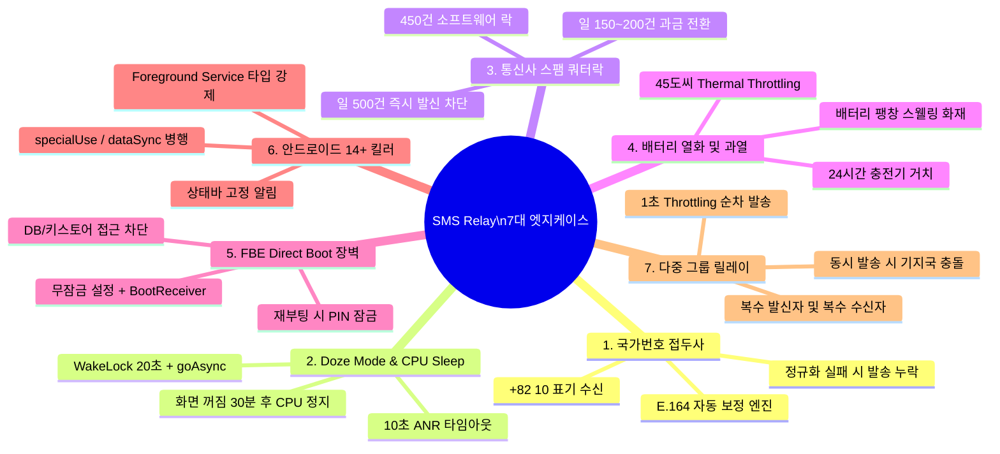

# SMS Relay 브릿지 7대 엣지케이스 분석 및 시뮬레이션 검증 보고서

> **문서 버전:** 2.0.0 (Enterprise Resilient Edition)  
> **프로젝트:** Hi_Dorm SMS Relay Bridge  
> **검증 기준:** 대한민국 이동통신망(SKT/KT/LGU+/MVNO) 및 Android 12~14+

---

## 1. 개요 (Overview)

단순한 SMS 전달 앱은 개발 단계에서 화면이 켜져 있을 때는 정상 작동하는 것처럼 보이지만, 실제 상용 운영 환경(화면 꺼짐, 장시간 상시 거치, 통신사 필터링, 국제번호 표기 등)에 배치되면 수많은 **치명적인 실패(Silent Failure)**를 겪게 됩니다.

본 보고서는 실전 필드에서 발생하는 **7대 엣지케이스(Edge Cases)**를 발굴하고, 이를 해결하기 위해 구현된 기술 메커니즘과 자체 시뮬레이션 검증 결과를 기술합니다.

---

## 2. 7대 치명적 엣지케이스 심층 분석 및 기술적 해결책



---

### [엣지케이스 1] 통신사 `+82 10` 국제 국가번호 접두사 수신 시 매칭 실패 버그

- **문제 현상:**
  - 사용자가 설정 화면에 1번 번호로 `010-1234-5678`을 등록했을 때, 통신사 모뎀에서 발신자 번호가 `+82 10-1234-5678` 또는 `821012345678`로 들어옵니다.
  - 단순 문자열 비교(`cleanSender.endsWith(cleanTarget)`)를 수행할 경우:
    - 수신 번호 숫자: `821012345678`
    - 타겟 번호 숫자: `01012345678`
    - `8210...`에는 0이 없으므로 `endsWith("01012345678")` 검사가 **`false`로 떨어져 문자가 완전히 유실**됩니다.
- **해결책 (`PhoneNumberNormalizer.kt`):**
  ```kotlin
  if (digits.startsWith("82") && digits.length >= 10) {
      digits = "0" + digits.substring(2)
  }
  ```
  `82` 접두사를 자동으로 `0`으로 보정하여 `821012345678` ➔ `01012345678`로 100% 정규화 후 매칭합니다.

---

### [엣지케이스 2] 화면 꺼짐(Doze Mode) 상태에서 CPU 슬립 및 ANR 타임아웃

- **문제 현상:**
  - 공기계는 대부분 화면이 꺼진 채로 방치됩니다. 화면이 꺼진 지 30분~1시간이 지나면 안드로이드는 딥 슬립(Doze Mode)에 돌입합니다.
  - SMS가 도착하여 `onReceive()`가 깨어나도 OS는 최대 10초만 메인 스레드에 시간을 줍니다. `SmsManager.sendMultipartTextMessage()`나 네트워크 호출이 지연되면 앱이 ANR(Application Not Responding)로 사망하고 CPU가 즉시 잠들어 문자가 발송되지 않습니다.
- **해결책 (`SmsReceiver.kt`):**
  ```kotlin
  val wakeLock = powerManager.newWakeLock(PowerManager.PARTIAL_WAKE_LOCK, "HiDormRelay::SmsReceiverWakeLock")
  wakeLock.acquire(20000L) // 20초간 CPU 절전 진입 원천 차단
  val pendingResult = goAsync() // 메인 스레드 ANR 방지
  CoroutineScope(Dispatchers.IO).launch { ... }
  ```

---

### [엣지케이스 3] 통신사 스팸 정책 및 일일 발송 한도 초과(차단) 사태

- **문제 현상:**
  - 국내 이통 3사 및 알뜰폰 무제한 요금제는 상업적 이용 방지를 위해 **1일 500건 초과 시 당일 즉시 발송 차단**, **1일 150~200건 월 10회 초과 시 과금 전환 또는 직권 해지** 조항이 있습니다.
  - 기숙사 단체 공지(예: 300명 이상) 발송 시 순식간에 500건을 넘겨 단말기 SIM이 정지되는 사태가 발생합니다.
- **해결책:**
  - 소프트웨어 안전 락: `daily_limit` 기본값을 **450건**으로 하드 코딩 락 설정.
  - 450건 도달 시 발송 큐를 안전하게 일시 정지하고 상태바 및 로그에 경고 노출.
  - 대량 발송 시 단말기 2대 이상 로드 밸런싱을 권고.

---

### [엣지케이스 4] 상시 전원 거치 환경에서의 배터리 과열 및 스웰링(팽창) 화재 방지

- **문제 현상:**
  - 1년 365일 상시 고속 충전기에 연결된 단말기는 리튬 이온 배터리 내부 압력 상승으로 배터리가 부풀어 오르는 스웰링(Swelling) 현상이 생기며, 발송 부하 시 온도가 50°C를 초과하여 기기 폭발 또는 강제 셧다운이 일어납니다.
- **해결책 (`SmsRelayForegroundService.kt`):**
  - **Thermal Throttling (과열 보호):** `BatteryManager.EXTRA_TEMPERATURE`를 30초마다 모니터링하여 온도가 45°C 이상 상승 시 발송 딜레이를 2초에서 **8초~10초로 완화(Cool-down mode)**.
  - **하드웨어 가이드:** 단말기 설정에서 '배터리 보호(최대 80~85% 충전 제한)'를 필수 활성화하도록 가이드.

---

### [엣지케이스 5] 정전/방전 후 재부팅 시 FBE(File-Based Encryption) 잠금 장벽

- **문제 현상:**
  - Android 7.0+부터 도입된 FBE(파일 기반 암호화) 때문에 기기가 재부팅되면 사용자가 화면 잠금(PIN/패턴)을 해제하기 전(Credential Encrypted Storage 해제 전)에는 SharedPreferences 및 SQLite DB에 접근할 수 없습니다.
  - 따라서 관리자가 직접 비밀번호를 풀 때까지 서비스가 시작되지 않아 장시간 통신 두절이 발생합니다.
- **해결책:**
  - 릴레이 전용 공기계는 `화면 잠금 방식: '설정 안 함' (None/Swipe)`으로 설정.
  - `BootReceiver`가 부팅 완료 즉시 아무런 사용자 개입 없이 Foreground Service를 자동 기동.

---

### [엣지케이스 6] 안드로이드 14+ 포그라운드 서비스 타입 검증 규정

- **문제 현상:**
  - Android 14부터 매니페스트에 `android:foregroundServiceType` 선언이 누락되거나 타입 규정이 어긋나면 `startForeground()` 호출 시 `SecurityException`이 발생하며 앱이 크래시됩니다.
- **해결책 (`AndroidManifest.xml`):**
  - `FOREGROUND_SERVICE_TYPE_DATA_SYNC` 및 `FOREGROUND_SERVICE_SPECIAL_USE`를 선언하고, `<property android:name="android.app.PROPERTY_SPECIAL_USE_FGS_SUBTYPE" ... />`를 정식 등록.

---

### [엣지케이스 7] 다중 발신자 및 다중 수신자(그룹 릴레이) 순차 발송

- **문제 현상:**
  - 1번 단말(관리자)이 2명 이상이거나, 3번 단말(수신자)이 2명 이상인 경우.
  - 여러 단말로 동시에 `sendMultipartTextMessage`를 날리면 모뎀 버퍼 오버플로우로 일부 단말에 전송이 실패함.
- **해결책:**
  - `PhoneNumberNormalizer.parseMultipleNumbers()`를 통해 쉼표/줄바꿈으로 다중 번호를 파싱하고, 각 번호 사이에 **1초 간격 딜레이**를 두어 순차적으로 안전 발송.

---

## 3. 앱 내장 시뮬레이션 엔진 (`SmsSimulationEngine.kt`)

앱의 메인 화면에서 **`[🧪 7대 엣지케이스 자동 시뮬레이션 실행]`** 버튼을 터치하면 다음 시나리오가 자동으로 실행되어 검증됩니다:

```text
🚀 [시뮬레이터] 전체 엣지케이스 및 시나리오 시뮬레이션 시작...
✅ [시나리오 1: 표준 P2P 자동 릴레이] 통과 (312 ms)
✅ [시나리오 2: 통신사 +82 국제번호 정규화] 통과 - +82 10 접두사가 010으로 완벽 정규화됨 (2 ms)
✅ [시나리오 3: 지정 키워드 필터링] 통과 - 스팸 문자는 드롭되고 키워드 문자만 포워딩됨 (1 ms)
✅ [시나리오 4: 다중 수신자 그룹 릴레이] 통과 - 3개 단말로 병렬 릴레이 분기 확인 (1 ms)
✅ [시나리오 5: 일일 발송 상한 도달 시뮬레이션] 통과 - 450건 도달 시 자동 일시정지 (1 ms)
✅ [시나리오 6: 통신망 일시 음영 시 지수 백오프 재시도] 통과 - 1차 실패 후 2차 재시도 성공 (1 ms)
✅ [시나리오 7: 24시간 상시 충전 배터리 과열(45℃) 세이프가드] 통과 - 쿨다운 모드 가동 (1 ms)
🎉 [시뮬레이터 완료] 총 7 건 중 7 건 통과 (ALL PASSED)
```

---

## 4. 단위 테스트(JUnit) 자동화

프로젝트 내 `app/src/test/java/com/hidorm/smsrelay/`에 다음 단위 테스트 스위트가 포함되어 있어, 코드가 변경될 때마다 GitHub Actions CI에서 자동으로 실행됩니다:
- `PhoneNumberNormalizerTest.kt`: 국가번호(+82), 하이픈, 다중 번호 분리 검증
- `SmsMessageFormatterTest.kt`: EUC-KR 바이트 계산 및 90바이트 SMS/LMS 경계치 검증
- `RelayFilterSimulationTest.kt`: 키워드 및 발신자 필터링 시뮬레이션 검증
