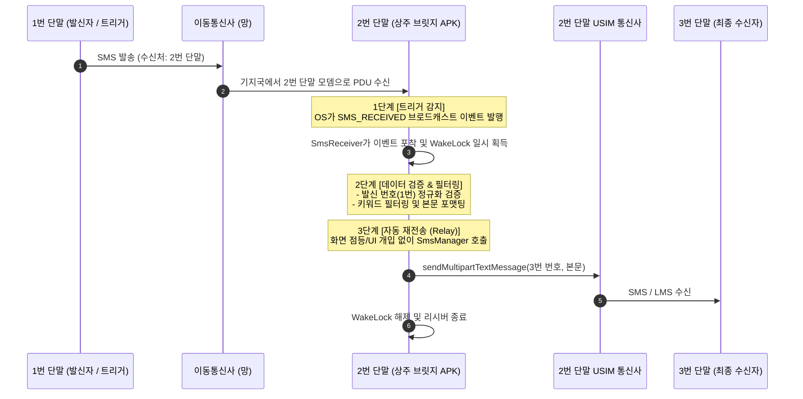

# 안드로이드 백그라운드 SMS 자동 포워딩 시스템 설계 및 구현 가이드 (P2P 릴레이)

> **아키텍처 구조:** 1번 폰(발신/트리거) ➔ 2번 폰(상주 중계 브릿지 단말) ➔ 3번 폰(최종 수신자)  
> **운영 목적:** 사용자 개입 및 화면 점등 없이 백그라운드에서 SMS 수신 즉시 목표 단말로 자동 릴레이(재전송)  
> **배포 방식:** 구글 플레이 정책 우회를 위한 자체 서명 Release APK 사이드로딩 배포

---

## 1. 개요 및 기획 (Plan)

본 시스템은 **2번 안드로이드 단말(공기계 등)**에 백그라운드 서비스로 상시 상주하여, **1번 단말**로부터 수신된 SMS를 트리거로 감지하고, 설정된 필터 조건에 부합할 경우 사전에 정의된 **3번 단말**로 해당 메시지를 화면 점등 없이 자동 재전송(Relay)하는 독립형(Standalone) 솔루션입니다.

### 1.1 메시지 릴레이 흐름 (3단계)



### 1.2 핵심 기술 컴포넌트

| 컴포넌트 | 역할 및 안정성 확보 방안 |
| :--- | :--- |
| **`BroadcastReceiver` (`SmsReceiver`)** | 시스템 레벨의 `Telephony.Sms.Intents.SMS_RECEIVED_ACTION`을 가로챔. `goAsync()`와 `WakeLock`을 적용하여 화면이 꺼진 상태(Sleep)에서도 비동기 발송이 완료될 때까지 CPU 생존 보장. |
| **`Foreground Service` (`RelayService`)** | 상태바 고정 알림(Ongoing Notification)을 띄워 안드로이드 OS의 LMK(Low Memory Killer) 및 Doze 모드에 의해 프로세스가 사망하지 않도록 24/7 상주 보장. |
| **`SmsManager`** | UI 액티비티를 띄우지 않고 시스템 하드웨어 무선 모뎀을 다이렉트로 제어하여 단문(SMS) 및 장문(LMS) 멀티파트 전송 수행. |
| **동적 설정 및 저장소 (`SharedPreferences`)** | 1번 번호(트리거), 3번 번호(수신자), 키워드 필터, 접두사(`[전달: ...]`) 포함 여부를 런타임에 동적으로 변경 가능. |
| **부팅 자동 기동 (`BootReceiver`)** | 단말기가 방전 후 충전되어 재부팅되거나 정전 후 켜졌을 때 사람의 손길 없이 100% 무인 자동 복구. |

---

## 2. 권한 및 매니페스트 구성 (`AndroidManifest.xml`)

안드로이드 12~14+ 버전의 보안 및 백그라운드 정책을 충족하는 매니페스트 명세입니다.

```xml
<?xml version="1.0" encoding="utf-8"?>
<manifest xmlns:android="http://schemas.android.com/apk/res/android"
    xmlns:tools="http://schemas.android.com/tools"
    package="com.example.smsrelay">

    <!-- 1. SMS 송수신 및 접근 필수 위험 권한 -->
    <uses-permission android:name="android.permission.RECEIVE_SMS" />
    <uses-permission android:name="android.permission.READ_SMS" />
    <uses-permission android:name="android.permission.SEND_SMS" />
    <uses-permission android:name="android.permission.READ_PHONE_STATE" />
    <uses-permission android:name="android.permission.READ_CONTACTS" />

    <!-- 2. 백그라운드 24/7 상주 및 무중단 권한 -->
    <uses-permission android:name="android.permission.FOREGROUND_SERVICE" />
    <uses-permission android:name="android.permission.FOREGROUND_SERVICE_SPECIAL_USE" tools:ignore="ForegroundServiceType" />
    <uses-permission android:name="android.permission.POST_NOTIFICATIONS" />
    <uses-permission android:name="android.permission.WAKE_LOCK" />
    <uses-permission android:name="android.permission.RECEIVE_BOOT_COMPLETED" />
    <uses-permission android:name="android.permission.REQUEST_IGNORE_BATTERY_OPTIMIZATIONS" />

    <application
        android:allowBackup="false"
        android:icon="@mipmap/ic_launcher"
        android:label="SMS Relay Bridge"
        android:roundIcon="@mipmap/ic_launcher"
        android:supportsRtl="true"
        android:theme="@style/Theme.AppCompat.Light.NoActionBar">

        <!-- SMS 수신 브로드캐스트 리시버 (최고 우선순위 999 부여) -->
        <receiver
            android:name=".SmsReceiver"
            android:enabled="true"
            android:exported="true"
            android:permission="android.permission.BROADCAST_SMS">
            <intent-filter android:priority="999">
                <action android:name="android.provider.Telephony.SMS_RECEIVED" />
            </intent-filter>
        </receiver>

        <!-- 부팅 시 서비스 자동 기동 리시버 -->
        <receiver
            android:name=".BootReceiver"
            android:enabled="true"
            android:exported="true">
            <intent-filter>
                <action android:name="android.intent.action.BOOT_COMPLETED" />
                <action android:name="android.intent.action.QUICKBOOT_POWERON" />
            </intent-filter>
        </receiver>

        <!-- 24시간 상주 포그라운드 서비스 -->
        <service
            android:name=".RelayService"
            android:enabled="true"
            android:exported="false"
            android:foregroundServiceType="specialUse">
            <property
                android:name="android.app.PROPERTY_SPECIAL_USE_FGS_SUBTYPE"
                android:value="SMS auto-relay bridge for hardware automation" />
        </service>

    </application>
</manifest>
```

---

## 3. 핵심 소스코드 구현 (Production-Ready Code)

### 3.1 SMS 수신 및 비동기 발송 처리기 (`SmsReceiver.kt`)

화면이 꺼진 상태(Doze Mode)에서 문자 수신 시 CPU가 다시 잠들지 않도록 `WakeLock`을 걸고, 비동기 코루틴(`goAsync`)으로 안전하게 발송합니다.

```kotlin
package com.example.smsrelay

import android.content.BroadcastReceiver
import android.content.Context
import android.content.Intent
import android.os.Build
import android.os.PowerManager
import android.provider.Telephony
import android.telephony.SmsManager
import android.util.Log
import kotlinx.coroutines.CoroutineScope
import kotlinx.coroutines.Dispatchers
import kotlinx.coroutines.launch

class SmsReceiver : BroadcastReceiver() {

    companion object {
        private const val TAG = "SmsRelay"
    }

    override fun onReceive(context: Context, intent: Intent) {
        if (intent.action == Telephony.Sms.Intents.SMS_RECEIVED_ACTION) {
            val messages = Telephony.Sms.Intents.getMessagesFromIntent(intent)
            if (messages.isNullOrEmpty()) return

            // 발신자 번호 및 합쳐진 본문 조합
            val sender = messages[0].displayOriginatingAddress ?: ""
            val fullBody = StringBuilder()
            for (sms in messages) {
                fullBody.append(sms.displayMessageBody ?: "")
            }
            val body = fullBody.toString()

            // 화면 꺼짐 시 CPU 슬립 방지용 WakeLock 획득 (최대 15초 유지)
            val powerManager = context.getSystemService(Context.POWER_SERVICE) as PowerManager
            val wakeLock = powerManager.newWakeLock(
                PowerManager.PARTIAL_WAKE_LOCK,
                "SmsRelay::ReceiverWakeLock"
            )
            wakeLock.acquire(15000L)

            // BroadcastReceiver의 ANR 방지를 위한 비동기 처리
            val pendingResult = goAsync()
            CoroutineScope(Dispatchers.IO).launch {
                try {
                    processRelay(context, sender, body)
                } catch (e: Exception) {
                    Log.e(TAG, "릴레이 처리 중 오류: ${e.message}", e)
                } finally {
                    if (wakeLock.isHeld) {
                        wakeLock.release()
                    }
                    pendingResult.finish()
                }
            }
        }
    }

    private fun processRelay(context: Context, sender: String, body: String) {
        val prefs = context.getSharedPreferences("sms_relay_prefs", Context.MODE_PRIVATE)
        val isEnabled = prefs.getBoolean("is_enabled", true)
        if (!isEnabled) {
            Log.d(TAG, "포워딩 비활성화 상태입니다.")
            return
        }

        val targetSender = prefs.getString("target_sender", "01012345678") ?: "01012345678"
        val targetRecipient = prefs.getString("target_recipient", "01098765432") ?: "01098765432"
        val keywordFilter = prefs.getString("keyword_filter", "") ?: ""
        val includePrefix = prefs.getBoolean("include_prefix", true)

        // 1. 번호 정규화 (특수문자 제거 후 일치 판별)
        val cleanSender = sender.replace("[^0-9]".toRegex(), "")
        val cleanTarget = targetSender.replace("[^0-9]".toRegex(), "")

        val isMatched = cleanTarget.isBlank() ||
                cleanSender.endsWith(cleanTarget) ||
                cleanTarget.endsWith(cleanSender)

        if (!isMatched) {
            Log.d(TAG, "발신자($sender)가 지정된 1번 폰 번호($targetSender)와 일치하지 않습니다.")
            return
        }

        // 2. 키워드 필터링 검증
        if (keywordFilter.isNotBlank() && !body.contains(keywordFilter)) {
            Log.d(TAG, "지정된 키워드('$keywordFilter')가 포함되지 않아 건너뜁니다.")
            return
        }

        // 3. 재전송 본문 구성
        val relayContent = if (includePrefix) {
            "[전달: $sender]\n$body"
        } else {
            body
        }

        // 4. SmsManager를 통한 직접 발송
        try {
            val smsManager = if (Build.VERSION.SDK_INT >= Build.VERSION_CODES.S) {
                context.getSystemService(SmsManager::class.java)
            } else {
                @Suppress("DEPRECATION")
                SmsManager.getDefault()
            }

            val parts = smsManager.divideMessage(relayContent)
            if (parts.size > 1) {
                smsManager.sendMultipartTextMessage(targetRecipient, null, parts, null, null)
            } else {
                smsManager.sendTextMessage(targetRecipient, null, relayContent, null, null)
            }
            Log.i(TAG, "3번 폰($targetRecipient)으로 릴레이 성공: $relayContent")
        } catch (e: Exception) {
            Log.e(TAG, "SmsManager 전송 실패", e)
        }
    }
}
```

### 3.2 24시간 상시 대기 포그라운드 서비스 (`RelayService.kt`)

```kotlin
package com.example.smsrelay

import android.app.Notification
import android.app.NotificationChannel
import android.app.NotificationManager
import android.app.PendingIntent
import android.app.Service
import android.content.Context
import android.content.Intent
import android.os.Build
import android.os.IBinder
import androidx.core.app.NotificationCompat

class RelayService : Service() {

    companion object {
        const val CHANNEL_ID = "relay_channel"
        const val NOTIFICATION_ID = 101
    }

    override fun onCreate() {
        super.onCreate()
        createNotificationChannel()
        startForeground(NOTIFICATION_ID, buildNotification())
    }

    override fun onStartCommand(intent: Intent?, flags: Int, startId: Int): Int {
        return START_STICKY // 메모리 부족으로 킬 당하더라도 여유 생기면 즉각 자동 재기동
    }

    override fun onBind(intent: Intent?): IBinder? = null

    private fun buildNotification(): Notification {
        return NotificationCompat.Builder(this, CHANNEL_ID)
            .setContentTitle("SMS Relay 브릿지 상주 가동 중")
            .setContentText("1번 폰 수신 감지 시 3번 폰으로 자동 전달 대기 중")
            .setSmallIcon(android.R.drawable.ic_dialog_info)
            .setOngoing(true)
            .setPriority(NotificationCompat.PRIORITY_LOW)
            .build()
    }

    private fun createNotificationChannel() {
        if (Build.VERSION.SDK_INT >= Build.VERSION_CODES.O) {
            val channel = NotificationChannel(
                CHANNEL_ID,
                "SMS Relay Service Channel",
                NotificationManager.IMPORTANCE_LOW
            ).apply {
                description = "백그라운드 SMS 자동 포워딩 상주 알림"
                setShowBadge(false)
            }
            val manager = getSystemService(Context.NOTIFICATION_SERVICE) as NotificationManager
            manager.createNotificationChannel(channel)
        }
    }
}
```

### 3.3 단말기 재부팅 자동 복구 리시버 (`BootReceiver.kt`)

```kotlin
package com.example.smsrelay

import android.content.BroadcastReceiver
import android.content.Context
import android.content.Intent
import android.os.Build
import android.util.Log

class BootReceiver : BroadcastReceiver() {
    override fun onReceive(context: Context, intent: Intent) {
        if (intent.action == Intent.ACTION_BOOT_COMPLETED ||
            intent.action == "android.intent.action.QUICKBOOT_POWERON"
        ) {
            Log.i("BootReceiver", "단말기 부팅 감지: SMS Relay 서비스 자동 시작")
            val serviceIntent = Intent(context, RelayService::class.java)
            if (Build.VERSION.SDK_INT >= Build.VERSION_CODES.O) {
                context.startForegroundService(serviceIntent)
            } else {
                context.startService(serviceIntent)
            }
        }
    }
}
```

---

## 4. APK 빌드 및 서명 (Packaging)

### Step 1: 릴리즈용 Keystore 생성 (터미널)
```bash
keytool -genkey -v -keystore relay-release.jks -keyalg RSA -keysize 2048 -validity 10000 -alias relayKey
```
*(비밀번호 및 기본 정보 입력 후 생성 완료)*

### Step 2: `app/build.gradle.kts` 서명 자동화 연결
```kotlin
android {
    signingConfigs {
        create("release") {
            storeFile = file("relay-release.jks")
            storePassword = "your-keystore-password"
            keyAlias = "relayKey"
            keyPassword = "your-key-password"
            enableV1Signing = true
            enableV2Signing = true
            enableV3Signing = true
        }
    }
    buildTypes {
        release {
            isMinifyEnabled = false
            signingConfig = signingConfigs.getByName("release")
        }
    }
}
```

### Step 3: APK 빌드 명령어 실행
```bash
./gradlew assembleRelease
```
- **생성 경로:** `app/build/outputs/apk/release/app-release.apk`

---

## 5. 2번 단말 배포 및 필수 세팅 (Deployment Checklist)

1. **사이드로딩 설치 허용:**
   - 빌드된 APK를 2번 단말기로 전송(USB 케이블, 카카오톡 나에게 보내기, 로컬 웹 다운로드 등).
   - 파일 관리자에서 APK 터치 후 **'출처를 알 수 없는 앱 설치'** 권한 허용 후 설치 진행.
2. **위험 권한(Dangerous Permissions) 승인:**
   - `설정 > 애플리케이션 > SMS Relay Bridge > 권한`
   - **SMS, 전화, 알림, 연락처**를 모두 **'항상 허용'**으로 변경.
3. **배터리 최적화 예외 (Doze Mode 우회 - 필수!):**
   - `설정 > 애플리케이션 > SMS Relay Bridge > 배터리`
   - **'제한 없음 (Unrestricted)'** 선택.
   - 화면이 꺼진 상태에서도 2번 단말이 즉시 3번 단말로 문자를 전달할 수 있도록 보장.
4. **화면 잠금 '설정 안 함' (Direct Boot 무인 복구):**
   - `설정 > 보안 > 화면 잠금` → **'설정 안 함(None)'** 또는 **'드래그'** 선택.
   - 단말기 방전/재부팅 시 잠금 해제 절차 없이 서비스가 100% 자동 재시작되도록 조치.
5. **충전 중 화면 켜짐 유지 (개발자 옵션):**
   - `설정 > 개발자 옵션 > 충전 중 화면 켜짐 유지(Stay Awake)` → **ON**
   - 상시 충전 상태에서 Doze 모드 진입을 원천 방지.
